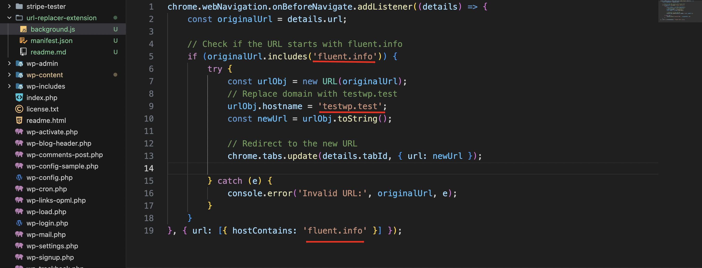
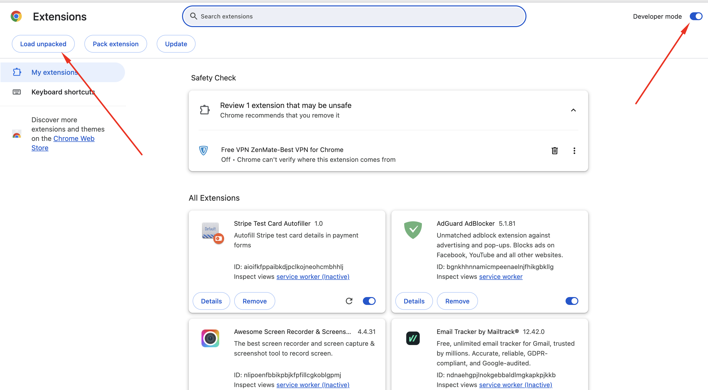

**_ What kind of extension is this? _**
This is a domain replacer extension created for personal requirement. This extension will automatically replace a domain from URL with another. For instance, if someone provides you a localhost URL and you have the exact same set up, just needs to change the domain then this extension is more powerfull.

** How to use? **
For instance, if you would like to replace fluent.info with testwp.test domain you need to do the following in the code

1. Replace fluent.info with the domain you would like to replace in the background.js

   

3. Replace testwp.test with your localhost domain.

Finally, in the chrome extension page, enable developer mode and select load unpacked to load the folder

[Watch the Demo Video](https://go.screenpal.com/watch/cThZjpn6OZq)
